Architecture
============

* Draws done with [excalidraw-desktop](https://github.com/pgkt04/excalidraw-desktop) --> [jabba-ai-architecture.excalidraw](jabba-ai-architecture.excalidraw)

The project is split into 3 and are completely independent of each other (aside of the actual API dependency)

* The User Interface (nuxt + vue) [jabba-ai-ui](https://github.com/Koubae/jabba-ai-ui)
* The Chat Application Logic + Authorization [jabba-ai-chat-app](https://github.com/Koubae/jabba-ai-chat-app)
* The AI-Bot [jabba-ai-bot](https://github.com/Koubae/jabba-ai-bot)

The Chat Application Logic and Authorization [jabba-ai-chat-app](https://github.com/Koubae/jabba-ai-chat-app)
is probably the most complex because is split in three services

* [chat-identity](https://github.com/Koubae/jabba-ai-chat-app/tree/master/internal/chat-identity)
* [chat-orchestrator](https://github.com/Koubae/jabba-ai-chat-app/tree/master/internal/chat-orchestrator)
* [chat-session](https://github.com/Koubae/jabba-ai-chat-app/tree/master/internal/chat-session)

#### [chat-identity](https://github.com/Koubae/jabba-ai-chat-app/tree/master/internal/chat-identity)

Authorizes and creates User's Accounts.
User's account source of truth. 
Create a new user account and create JWT tokens.

#### [chat-orchestrator](https://github.com/Koubae/jabba-ai-chat-app/tree/master/internal/chat-orchestrator)

Serves as a Api-Gateway for the application as well as permanent storage for Applications sessions, messages and more.
Clients will communicate with the Chat-Orchestrator directly as they won't create sessions themselves.
It also returns the Chat-Session URL to then connect via WebSocket

The idea behind this is that we could have multiple Chat-Session pods and Chat-Orchestrator acts also as load-balancer.

**NOTE:** some of the implementation is not done yet, like storing the messages and members

### [chat-session](https://github.com/Koubae/jabba-ai-chat-app/tree/master/internal/chat-session)

Is the actual Chat and holds the chat logic.
Communicates with the User's and The Chat-Bot, acts as a messanger

### The AI-Bot [jabba-ai-bot](https://github.com/Koubae/jabba-ai-bot)

The Chat App is a basic AI model train to chat by using [ollama](https://ollama.com/).
Both `openchat` | `neural-chat` are available, but I found `neural-chat` faster and more suited to this project.

Is built with python and can communicate both via HTTP or Websocket using FastaAPI but the [chat-session](https://github.com/Koubae/jabba-ai-chat-app/tree/master/internal/chat-session)
will use the HTTP in order to avoid holding too much connection so in a sense "is stateless"

However, it keeps in memory the messages so is not truly stateliness. 
For each session the Bot will have its unique conversation which is configurable by `BOT_CONTEXT_LENGHT` (defaults to 50)
However, once the conversation is reset the way it works is that it creates a new system message with the summary of 
what has been discussed and so it feels like the conversations is a unique no stop.

### Overview

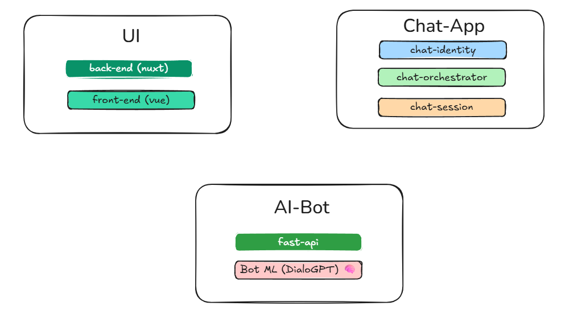

#### Flow

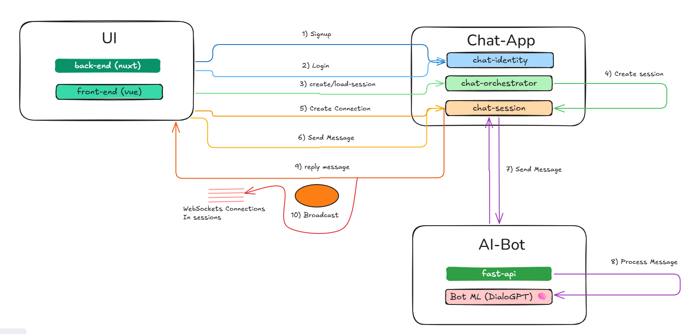

#### Jabba-UI

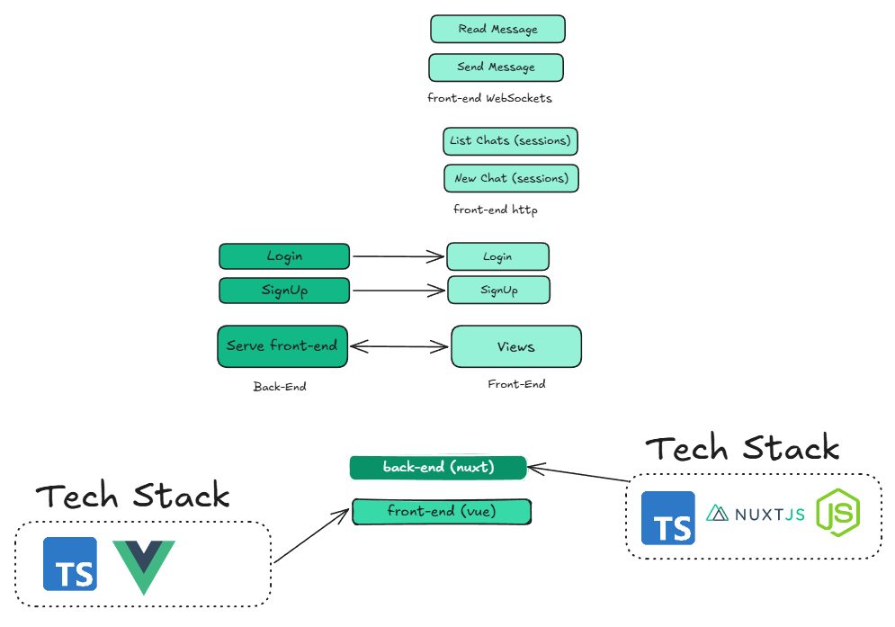

#### ChatIdentity

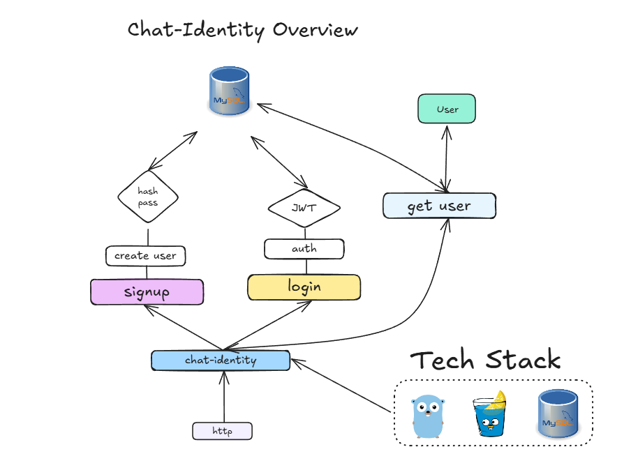

#### ChatOrchestrator

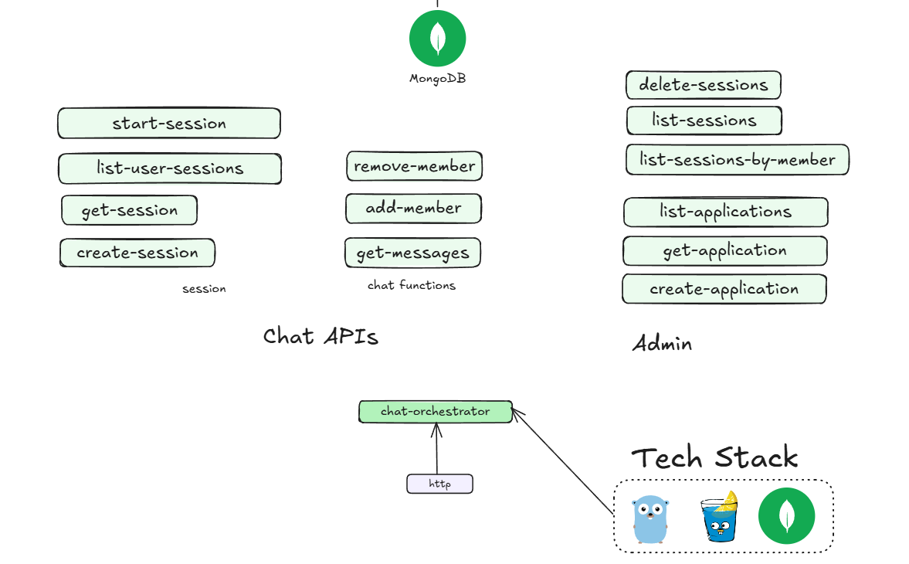

**database schema**
Note: this is not fully implemented yet!

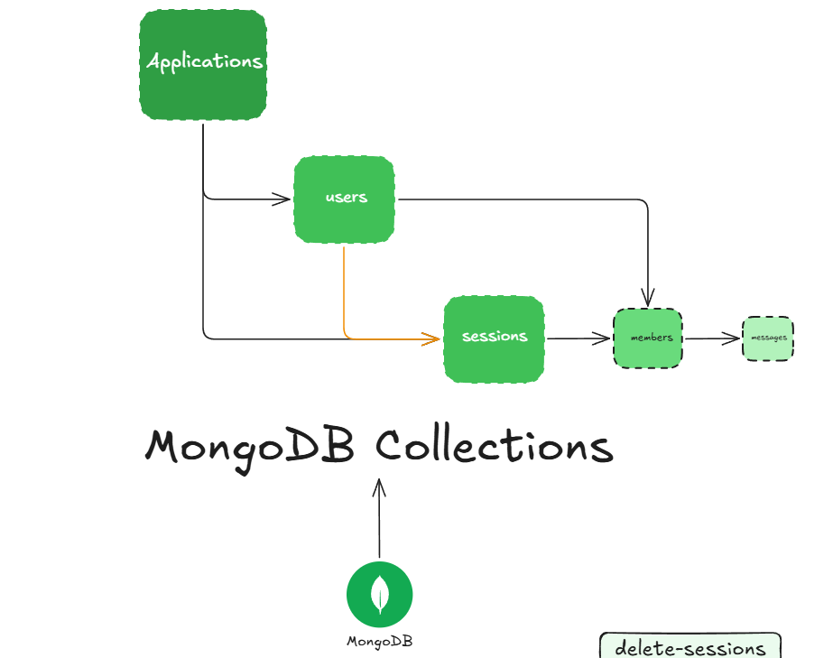

#### ChatSession

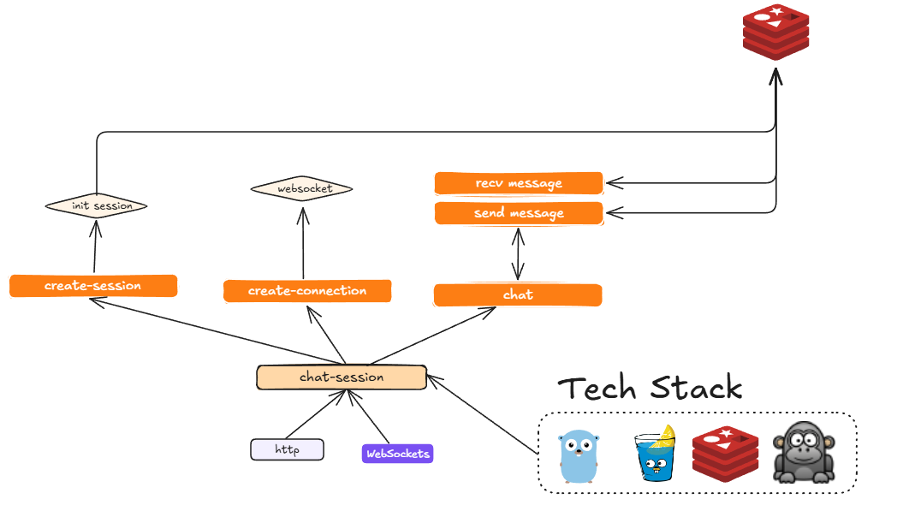

#### AI-Bot

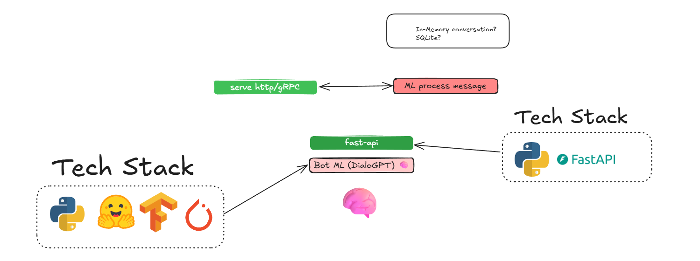

Views
-----

### Welcome View

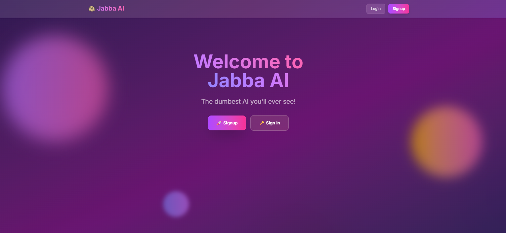

### Signup View

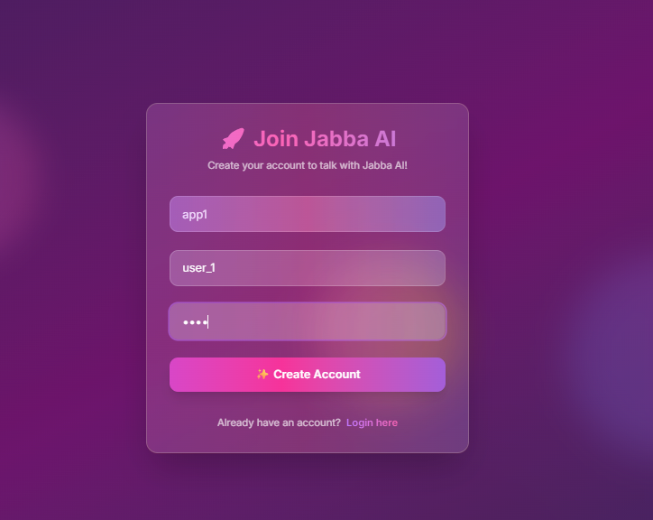

### Login View

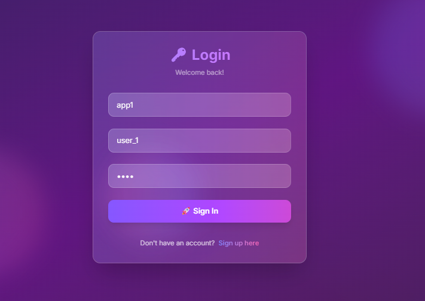

### Dashboard

### User Profile

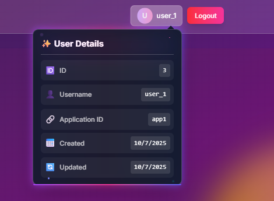

### Application

#### Create Application

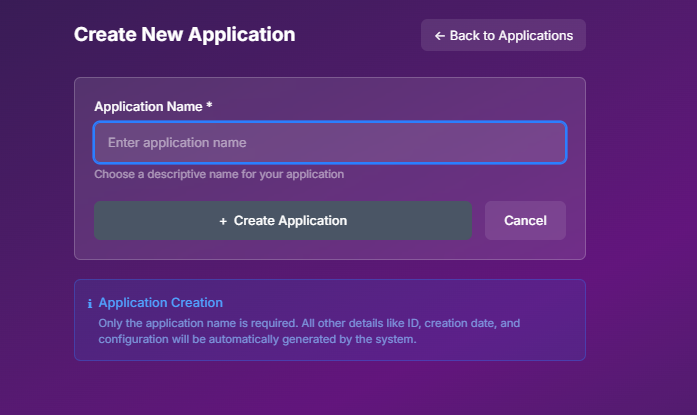

#### Applications

#### Application View

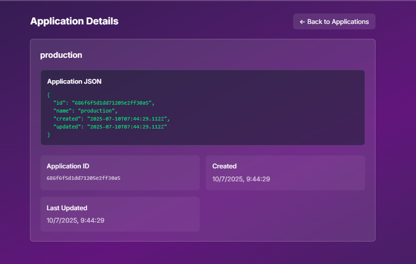

### Session

#### Create Session

#### Sessions

#### Session View

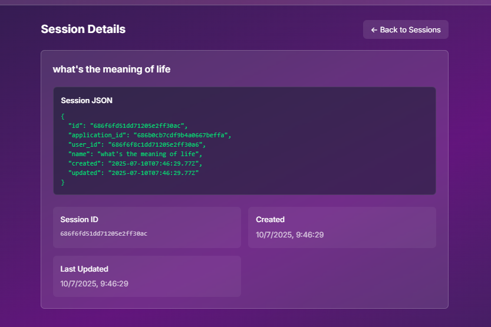

### Chat

**Single Chat** Chat GPT style

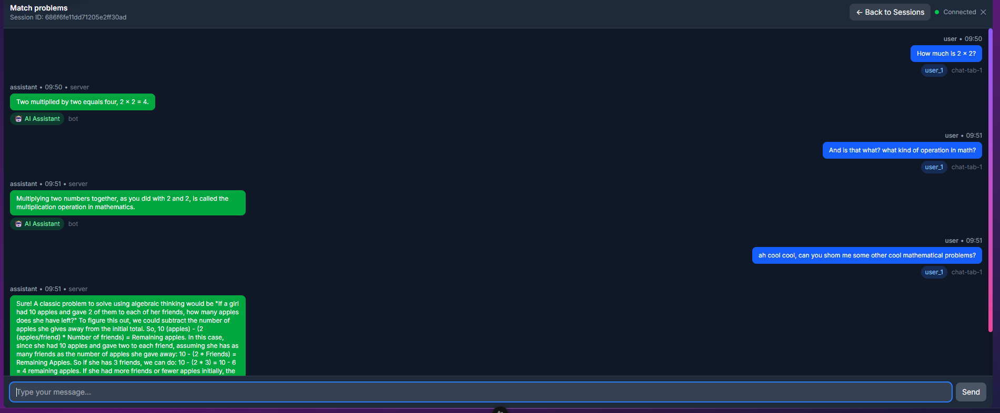

**Multi Chat** , multiple member in the same chat!

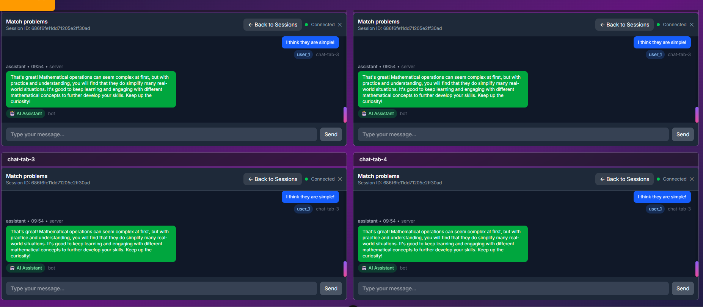

**Message Raw content**

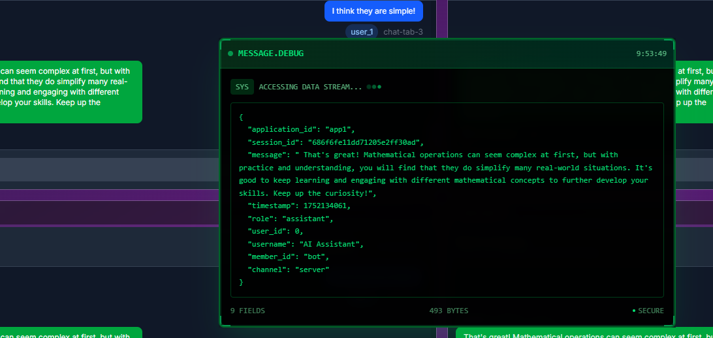
